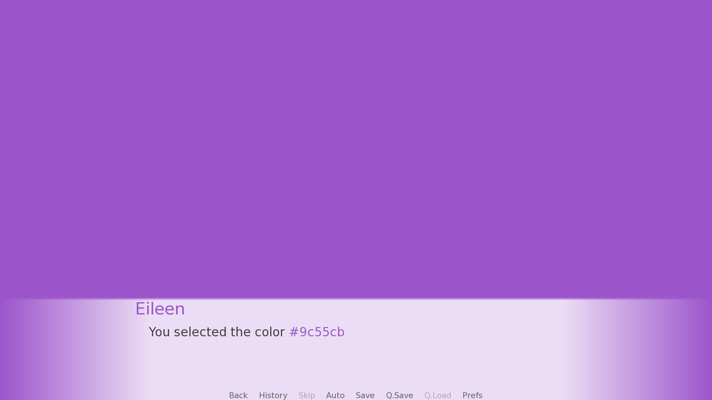

= Ren'Py Color Sliders

Allow players to choose colors via RGB/HSL color sliders!

image::.assets/rotate.gif[]

Includes a screen named `"color_picker"`.

== Usage

. Download the latest release `cs-slim` zip.
. Unpack it in your project directory (the one right above `game`).
. Call the color picker screen.
+
[source, python]
----
label start:
    e "Pick a color."

    window hide
    $ bg_color = renpy.call_screen("color_picker")
    window show

    e "You selected the color {color=[bg_color]}[bg_color]{/color}"
----
. Use the returned hex code string for whatever you like, for example changing
the colors of the background, dialogue text, or character names.
+

== License

This source code and project are released under the MIT license, which to
paraphrase in a way that is not legally binding:

* You can use it for free things
* You can use it for paid things
* You can modify it however you see fit
* You can redistribute it as you see fit
* Go nuts!

For a better breakdown of what the license actually means see:
https://choosealicense.com/licenses/mit/

I do ask that you credit me in some way, but if you don't I'm not gonna call the
open-source police on you.  If you do choose to credit me you can do so by
providing a link to my link:https://github.com/Foxcapades[GitHub], my
link:https://foxcapades.itch.io/[Itch.io], or just call me Foxcapades.